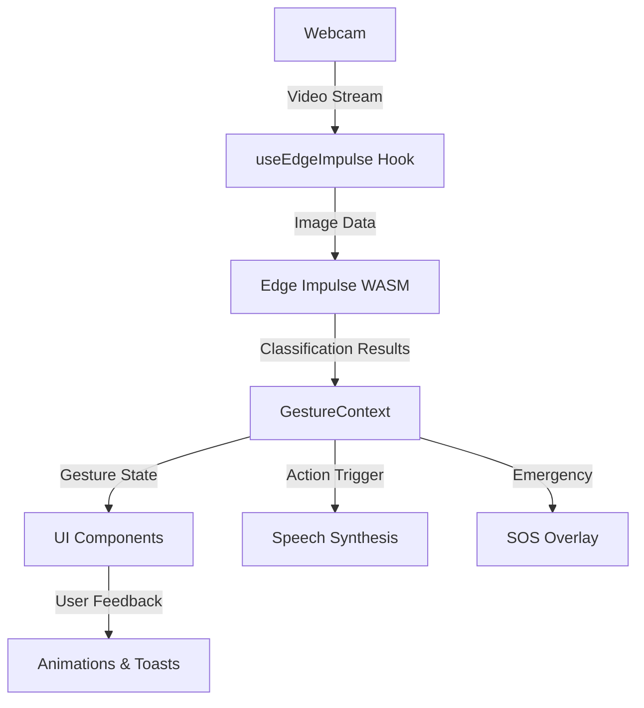

# 🧠 NeuroFocus

<div align="center">


**Next-Generation Gesture-Controlled Medical HUD**

[](https://www.typescriptlang.org/)
[](https://reactjs.org/)
[](https://vitejs.dev/)
[](https://tailwindcss.com/)
[](https://edgeimpulse.com/)
[](LICENSE)

[Features](#-features) • [Demo](#-demo) • [Installation](#-installation) • [Usage](#-usage) • [Architecture](#-architecture) • [Contributing](#-contributing)

</div>

---

## 🌟 Overview

**NeuroFocus** is a cutting-edge, futuristic medical Heads-Up Display (HUD) that leverages real-time gesture recognition powered by Edge Impulse machine learning models. Designed for hands-free patient interaction in healthcare environments, NeuroFocus enables patients to control their environment, call for assistance, and interact with medical staff through intuitive hand gestures captured via webcam.

### 🎯 Key Highlights

- **🤖 AI-Powered Gesture Recognition** - Real-time ML inference using Edge Impulse WASM models
- **🎨 Futuristic Medical HUD** - Glassmorphic, neon-styled interface inspired by sci-fi medical interfaces
- **♿ Accessibility-First** - WCAG 2.1 AA compliant with ARIA labels and keyboard navigation
- **📊 Real-Time Analytics** - Live confidence graphs, vitals monitoring, and animated data visualization
- **🚨 Emergency SOS System** - Gesture-activated emergency alerts with audio-visual feedback
- **🌓 Theme Switching** - Dark/light mode with smooth transitions
- **📱 Responsive Design** - Optimized for desktop, tablet, and mobile devices
- **⚡ High Performance** - Built with Vite for lightning-fast development and optimized builds

---

## ✨ Features

### 🖐️ Gesture Control System

- **Real-time hand gesture recognition** using Edge Impulse ML models
- **4 primary gestures** mapped to common patient actions:
  - 🏥 **Call Nurse** - Summon medical assistance
  - 🎵 **Music** - Control entertainment systems
  - 💡 **Lights** - Adjust room lighting
  - 💬 **Message** - Send communication requests
- **SOS Emergency Gesture** - Dedicated panic/emergency alert system
- **Confidence threshold filtering** - Ensures accurate gesture detection (>60% confidence)
- **Simulation mode** - Test gestures without a camera for development

### 🎨 Futuristic UI/UX

- **Glassmorphic Design** - Frosted glass effects with backdrop blur
- **Neon Accents** - Cyan, green, purple, and pink glow effects
- **Animated Components**:
  - Pulse effects on active elements
  - Smooth transitions and hover states
  - SVG path animations with anime.js
  - Framer Motion physics-based animations
- **Custom HUD Elements**:
  - Real-time confidence graph with animated bars
  - 3D health visualization with Three.js
  - Animated vitals graphs (heart rate, BP, SpO₂)
  - Patient profile cards with status indicators
  - Floating navigation sidebar

### 📊 Medical Dashboard Features

- **Patient Vitals Panel** - Real-time monitoring of:
  - Heart rate (BPM)
  - Blood pressure (mmHg)
  - Blood oxygen saturation (SpO₂)
  - Temperature (°F)
- **Animated Health Graphs** - Recharts-powered data visualization
- **3D Health HUD** - Three.js 3D scene with rotating geometry
- **Status Indicators** - Color-coded patient status (Stable, Critical, etc.)
- **Patient Profile Card** - Quick access to patient demographics

### 🔒 Security & Accessibility

- **Privacy-First** - All ML inference runs locally in the browser (no data sent to servers)
- **WCAG 2.1 AA Compliant** - Full keyboard navigation and screen reader support
- **ARIA Labels** - Semantic HTML with proper accessibility attributes
- **Focus Management** - Clear focus indicators and logical tab order
- **Speech Synthesis** - Audio feedback for gesture actions
- **High Contrast Mode** - Enhanced visibility for low-vision users

---

## 🎥 Demo

### Live Demo
> *Coming Soon - Deployment in progress*

### Screenshots

<div align="center">

| Main Dashboard | Gesture Detection | Emergency SOS |
|:-------------:|:-----------------:|:-------------:|
|  |  |  |

| Vitals Panel | 3D Health HUD | Confidence Graph |
|:------------:|:-------------:|:----------------:|
|  |  |  |

</div>

---

## 🚀 Installation

### Prerequisites

Before you begin, ensure you have the following installed:

- **Node.js** (v18.0.0 or higher) - [Download](https://nodejs.org/)
- **npm** (v9.0.0 or higher) or **yarn** (v1.22.0 or higher)
- **Modern browser** with WebAssembly support (Chrome, Firefox, Edge, Safari)
- **Webcam** (for real-time gesture detection)

### Quick Start

1. **Clone the repository**

```bash
git clone https://github.com/hariteja-01/NeuroFocus.git
cd NeuroFocus/project
```

2. **Install dependencies**

```bash
npm install
# or
yarn install
```

3. **Add your Edge Impulse model**

Place your Edge Impulse WASM model files in the `public/` directory:
- `edge-impulse-standalone.js` - Your trained gesture recognition model

> **Note**: To train your own model, visit [Edge Impulse](https://edgeimpulse.com/) and follow their gesture recognition tutorials.

4. **Start the development server**

```bash
npm run dev
# or
yarn dev
```

5. **Open your browser**

Navigate to `http://localhost:5173` (or the port shown in your terminal)

---

## 📖 Usage

### Basic Usage

1. **Allow Camera Access** - Grant webcam permissions when prompted
2. **Position Your Hand** - Place your hand in view of the camera
3. **Perform Gestures** - Make the gestures you trained your ML model to recognize
4. **View Results** - Watch the confidence graph and see actions trigger

### Gesture Training (Edge Impulse)

To train your own gesture recognition model:

1. Create an account at [Edge Impulse](https://edgeimpulse.com/)
2. Create a new project and select "Images" as the data type
3. Collect image samples for each gesture (minimum 50 per gesture)
4. Train your model using the Edge Impulse Studio
5. Deploy as **WebAssembly** and download the files
6. Replace the files in your `public/` directory

### Configuration

#### Gesture Mapping

Edit `src/App.tsx` to customize gesture actions:

```tsx
const actions = [
  { id: 0, label: 'CALL NURSE', icon: '🏥' },
  { id: 1, label: 'MUSIC', icon: '🎵' },
  { id: 2, label: 'LIGHTS', icon: '💡' },
  { id: 3, label: 'MESSAGE', icon: '💬' },
];
```

#### Confidence Threshold

Adjust the minimum confidence threshold in `src/hooks/useEdgeImpulse.ts`:

```typescript
// Change 0.6 to your desired threshold (0.0 - 1.0)
if (result.confidence > 0.6) {
  // Trigger action
}
```

#### Theme Customization

Modify colors in `tailwind.config.js`:

```javascript
colors: {
  'neon-blue': '#00d4ff',
  'neon-green': '#00ff9d',
  'neon-purple': '#b400ff',
  'neon-pink': '#ff00e5',
  // Add your custom colors
}
```

---

## 🏗️ Architecture

### Tech Stack

| Category | Technology | Purpose |
|----------|-----------|---------|
| **Framework** | React 18.3 | UI component library |
| **Language** | TypeScript 5.5 | Type-safe development |
| **Build Tool** | Vite 5.4 | Fast development & optimized builds |
| **Styling** | Tailwind CSS 3.4 | Utility-first CSS framework |
| **Animations** | Framer Motion | Physics-based animations |
| **3D Graphics** | Three.js | 3D health visualization |
| **Charts** | Recharts | Data visualization |
| **ML Runtime** | Edge Impulse WASM | On-device ML inference |
| **Camera** | react-webcam | Webcam access |
| **Notifications** | Sonner | Toast notifications |
| **Icons** | Lucide React | Icon library |

### Project Structure

```
NeuroFocus/
├── public/
│   └── edge-impulse-standalone.js    # Edge Impulse WASM model
├── src/
│   ├── components/                   # React components
│   │   ├── ActionGrid.tsx           # Gesture action buttons
│   │   ├── AnimatedHUDLoader.tsx    # Loading animation
│   │   ├── AnimatedVitalsGraph.tsx  # Animated health graphs
│   │   ├── CameraFeed.tsx           # Webcam component
│   │   ├── ConfidenceGraph.tsx      # ML confidence visualization
│   │   ├── FuturisticCard.tsx       # Reusable card component
│   │   ├── PatientProfileCard.tsx   # Patient info card
│   │   ├── SOSOverlay.tsx           # Emergency overlay
│   │   ├── StatusSidebar.tsx        # Status information
│   │   ├── ThreeDHealthHUD.tsx      # 3D visualization
│   │   └── VitalsPanel.tsx          # Vitals monitoring
│   ├── context/
│   │   └── GestureContext.tsx       # Global gesture state
│   ├── hooks/
│   │   ├── useEdgeImpulse.ts        # ML inference hook
│   │   └── useGestureSimulation.ts  # Gesture simulation
│   ├── layouts/
│   │   └── HUDLayout.tsx            # Main HUD layout
│   ├── utils/
│   │   └── edge-impulse-wrapper.js  # Edge Impulse wrapper
│   ├── App.tsx                       # Main app component
│   ├── main.tsx                      # App entry point
│   └── index.css                     # Global styles
├── index.html                        # HTML template
├── package.json                      # Dependencies
├── tailwind.config.js                # Tailwind configuration
├── tsconfig.json                     # TypeScript config
├── vite.config.ts                    # Vite configuration
└── README.md                         # This file
```

### Data Flow



### Key Components

#### 1. **Edge Impulse Integration** (`useEdgeImpulse.ts`)
- Captures webcam frames at regular intervals
- Converts image data to RGB pixel array
- Runs ML inference using Edge Impulse WASM
- Updates gesture context with classification results

#### 2. **Gesture Context** (`GestureContext.tsx`)
- Global state management for gesture recognition
- Provides gesture data to all components
- Handles confidence thresholds and filtering

#### 3. **HUD Layout** (`HUDLayout.tsx`)
- Main dashboard structure
- Floating navigation sidebar
- Theme switching logic
- SOS overlay management

#### 4. **Action Grid** (`ActionGrid.tsx`)
- Displays available gesture actions
- Highlights active/detected gestures
- Triggers speech synthesis feedback

---

## 🧪 Development

### Available Scripts

```bash
# Start development server
npm run dev

# Build for production
npm run build

# Preview production build
npm run preview

# Run TypeScript type checking
npm run typecheck

# Run ESLint
npm run lint
```

### Code Quality

This project follows industry best practices:

- ✅ **TypeScript** - Full type safety
- ✅ **ESLint** - Code linting with React best practices
- ✅ **Prettier** - Code formatting (configure as needed)
- ✅ **Strict Mode** - React Strict Mode enabled
- ✅ **Semantic HTML** - Proper HTML5 elements
- ✅ **ARIA Labels** - Full accessibility support

### Testing

```bash
# Run unit tests (to be implemented)
npm test

# Run E2E tests (to be implemented)
npm run test:e2e
```

---

## 🤝 Contributing

Contributions are welcome! Please follow these steps:

1. **Fork the repository**
2. **Create a feature branch** (`git checkout -b feature/AmazingFeature`)
3. **Commit your changes** (`git commit -m 'Add some AmazingFeature'`)
4. **Push to the branch** (`git push origin feature/AmazingFeature`)
5. **Open a Pull Request**

### Contribution Guidelines

- Follow the existing code style
- Write meaningful commit messages
- Add TypeScript types for all new code
- Update documentation for new features
- Test your changes thoroughly
- Ensure accessibility standards are met

---

## 🐛 Troubleshooting

### Common Issues

#### Webcam Not Working

- **Check browser permissions** - Ensure camera access is granted
- **HTTPS required** - Webcam only works on `localhost` or HTTPS sites
- **Browser compatibility** - Use Chrome, Firefox, Edge, or Safari

#### Edge Impulse Model Not Loading

- **Check file path** - Ensure `edge-impulse-standalone.js` is in `public/`
- **WASM support** - Verify your browser supports WebAssembly
- **Console errors** - Open browser DevTools and check for errors

#### Low Gesture Accuracy

- **Improve lighting** - Ensure good lighting conditions
- **Retrain model** - Collect more diverse training samples
- **Adjust threshold** - Lower the confidence threshold in settings
- **Camera quality** - Use a higher quality webcam

#### Performance Issues

- **Close background apps** - Free up system resources
- **Update browser** - Use the latest browser version
- **Reduce animation complexity** - Disable some visual effects
- **Check CPU/GPU** - Ensure adequate hardware capabilities

---

## 📄 License

This project is licensed under the **MIT License** - see the [LICENSE](LICENSE) file for details.

```
MIT License

Copyright (c) 2025 NeuroFocus

Permission is hereby granted, free of charge, to any person obtaining a copy
of this software and associated documentation files (the "Software"), to deal
in the Software without restriction, including without limitation the rights
to use, copy, modify, merge, publish, distribute, sublicense, and/or sell
copies of the Software, and to permit persons to whom the Software is
furnished to do so, subject to the following conditions:

The above copyright notice and this permission notice shall be included in all
copies or substantial portions of the Software.

THE SOFTWARE IS PROVIDED "AS IS", WITHOUT WARRANTY OF ANY KIND, EXPRESS OR
IMPLIED, INCLUDING BUT NOT LIMITED TO THE WARRANTIES OF MERCHANTABILITY,
FITNESS FOR A PARTICULAR PURPOSE AND NONINFRINGEMENT. IN NO EVENT SHALL THE
AUTHORS OR COPYRIGHT HOLDERS BE LIABLE FOR ANY CLAIM, DAMAGES OR OTHER
LIABILITY, WHETHER IN AN ACTION OF CONTRACT, TORT OR OTHERWISE, ARISING FROM,
OUT OF OR IN CONNECTION WITH THE SOFTWARE OR THE USE OR OTHER DEALINGS IN THE
SOFTWARE.
```

---

## 🙏 Acknowledgments

- **[Edge Impulse](https://edgeimpulse.com/)** - ML platform for embedded devices
- **[React Team](https://reactjs.org/)** - React framework
- **[Tailwind Labs](https://tailwindcss.com/)** - Tailwind CSS
- **[Framer](https://www.framer.com/motion/)** - Framer Motion animation library
- **[Three.js](https://threejs.org/)** - 3D graphics library
- **[Recharts](https://recharts.org/)** - Chart library
- **Healthcare UI Inspiration** - Various sci-fi medical interfaces

---

## 📞 Contact & Support

- **Repository**: [github.com/hariteja-01/NeuroFocus](https://github.com/hariteja-01/NeuroFocus)
- **Issues**: [github.com/hariteja-01/NeuroFocus/issues](https://github.com/hariteja-01/NeuroFocus/issues)
- **Discussions**: [github.com/hariteja-01/NeuroFocus/discussions](https://github.com/hariteja-01/NeuroFocus/discussions)

---

## 🗺️ Roadmap

### Version 1.1 (Planned)
- [ ] User authentication and patient profiles
- [ ] Database integration for vitals history
- [ ] Multi-language support (i18n)
- [ ] Voice commands integration
- [ ] Mobile app (React Native)

### Version 1.2 (Future)
- [ ] EHR (Electronic Health Record) integration
- [ ] Real-time vitals from medical devices
- [ ] Telemedicine video call support
- [ ] AI-powered health insights
- [ ] Offline mode with local storage

### Version 2.0 (Vision)
- [ ] VR/AR headset support
- [ ] Multi-patient monitoring dashboard
- [ ] Hospital-wide deployment system
- [ ] HIPAA compliance certification
- [ ] Integration with major hospital systems

---

## 📊 Stats


---

<div align="center">

**⭐ If you find NeuroFocus helpful, please consider giving it a star! ⭐**

Made with ❤️ by the NeuroFocus Team

[⬆ Back to Top](#-neurofocus)

</div>
